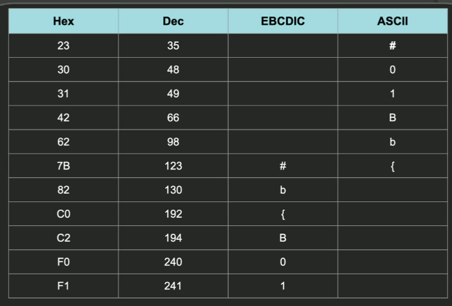
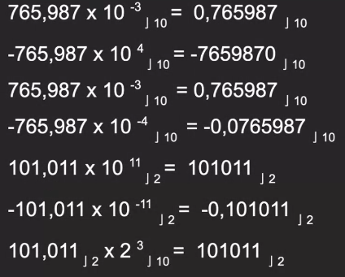
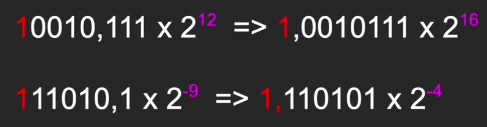
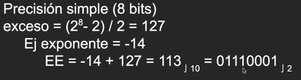
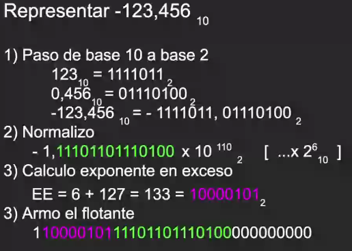
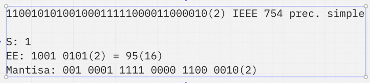
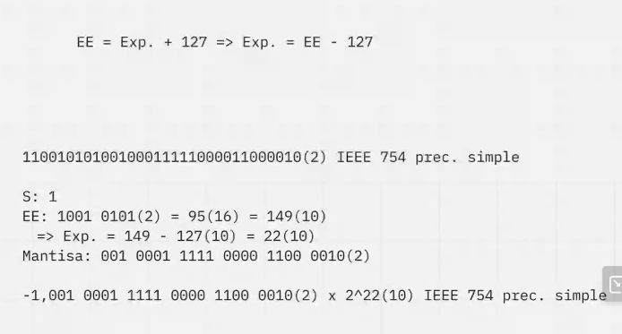
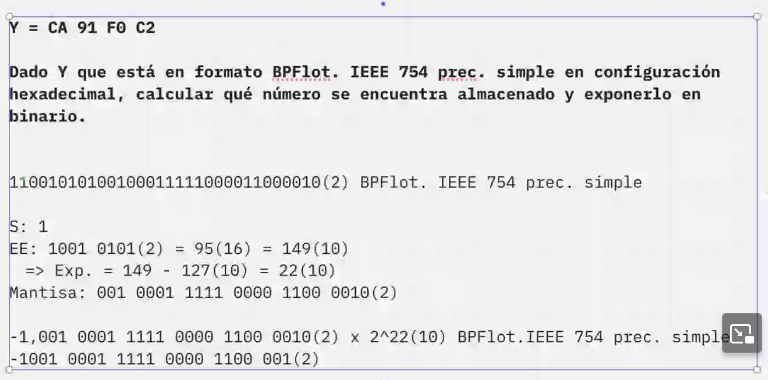
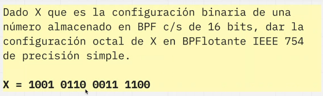
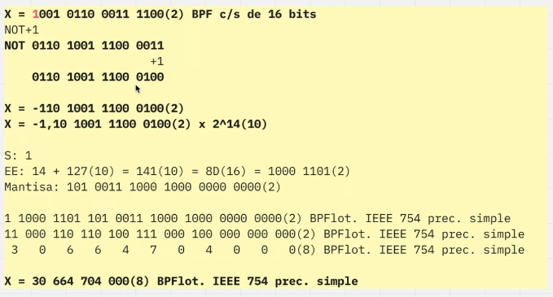

# Enunciado Parcial
De A están viendo la configuración decimal de un número almacenado en formato EMPAQUETADO de 2 byte
#### A = 4669
- *Dame configuración y formato o no te puedo dar una respuesta*
#### A = 4669(10) EMPAQUETADO en 2 bytes
- ¿En que base necesito pasar para entender el número?
- *A Hexadecimal se ven los dígitos y es mejor legibilidad para los humanos*
#### 123D (16) EMPAQUETADO en 2 bytes
- Lo vamos a sacar del formato y pasarlo en base 10
#### Resultado = -123(10)
- ¿Cuando cambiamos de base seguimos en la misma configuración?
- *SI, sin independientes*

### Otro ejemplo
173(8) Conviertelo en EMPAQUETADO de 2 bytes
- 173A(16) **ESTA MAL**
#### LA PARTIDA DEBE SER DESDE DECIMAL!!
 

# Clase
## Formatos de representación caracteres
   - ASCII *8bits*
   - EBCDIC *8bits*
   - UNICODE *Codigo extendido standar de caracteres*
 

**No es arbitrario, hay que pasar el correcto**
### Ejemplo
 
`No todas las combinaciones tienen un caracter asignado`

## Binario de punto flotante IEEE754 ☁️
- Notación científica S M x B (^E)
- **EL NUMERO DEBE SER EXPRESADO A LA BASE POR EXPONENTE**
- 101,011 X (^11)(2) = 101011(2) `Elevado a la 11 es 3`

- Precisión Simple y Doble. Varía la cantidad de bits que podemos utilizar
#### 1 bit, singo - 8bits, exponente en exceso, 23 bits los números pos coma (Fracción)
#### Lo mismo pero 16bits y 56bits para el Precisión doble
### Matisa normalizada
- Correr la coma lo necesario hasta que el el 1 más significativo quede como único valor

 
- Se puede representar 126 para arriba y 127 para abajo, incluyendo el 0

- Pasar de exponente en exceso a exponente (normalizado/en concreto, aclaración no necesaria)

### Ejemplo completo

### El EXCESO sirve para representar números negativos

### Otro ejemplo

- La base 10 es pivote
- Se puede saltear una base pivote si una es potencia de la otra
- Siempre conviene justificar cuando se aplique
### Pasar de base 2 a 16 y de 16 a 10 porque hace menos cuentas

### Otro ejemplo más

### Otro ejemplo pero de examen

# EJERCICIO DE EXAMEN IMPORTANTE
- Siguiente número: 1001 0110 0011 1100(2) BPF c/s de 16 bits
- Binario de punto fijo con signo

- X = 1001 0110 0011 1100(2) -> 1,001 0110 0011 1100(2)  x  2^15(10)
#### ESTA MAL!!! ⛔
##### Este número esta en formato de binario en punto fijo con *BIT DE SIGNO!!*
- Se tiene que llevar a binario de punto fijo sin signo
- Se utiliza el NOT+1
- 1001 0110 0011 1100(2) = NOT 0110 1001 1100 0011(2) **+1**
- X = -110 1001 1100 0100(2)
- X = -1,10 1001 1100 0100(2) x 2^14(10) ✅

