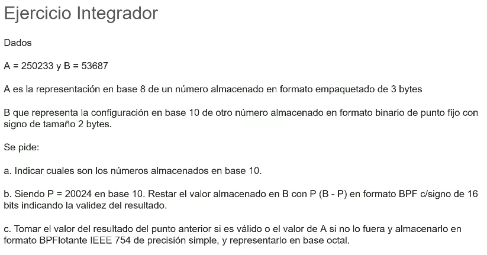
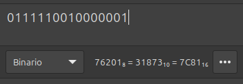
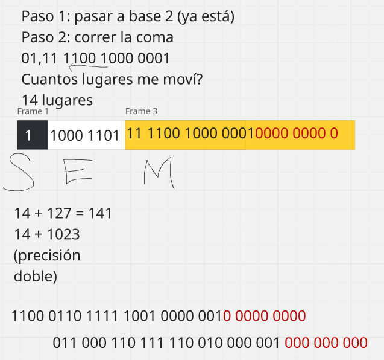

## Repaso

### Formato y Configuración de Números

#### Conceptos Fundamentales
- **Formato**: Es la forma de representar un número siguiendo una serie de reglas y convenciones específicas
- **Configuración**: Se refiere a la base de representación de un número y cómo se estructuran sus dígitos

#### Sistemas de Numeración

##### 1. Sistema Decimal (Base 10)
- **Base**: 10
- **Dígitos**: 0, 1, 2, 3, 4, 5, 6, 7, 8, 9
- **Ejemplo**: 1234₁₀ = 1×10³ + 2×10² + 3×10¹ + 4×10⁰
- **Punto decimal**: Para números fraccionarios (ej: 123.45)

##### 2. Sistema Binario (Base 2)
- **Base**: 2
- **Dígitos**: 0, 1
- **Ejemplo**: 1101₂ = 1×2³ + 1×2² + 0×2¹ + 1×2⁰ = 13₁₀
- **Punto binario**: Para fracciones (ej: 101.11₂ = 5.75₁₀)

##### 3. Sistema Hexadecimal (Base 16)
- **Base**: 16
- **Dígitos**: 0-9, A, B, C, D, E, F (donde A=10, B=11, C=12, D=13, E=14, F=15)
- **Ejemplo**: 2AF₁₆ = 2×16² + 10×16¹ + 15×16⁰ = 687₁₀
- **Uso común**: Representación compacta de datos binarios

##### 4. Sistema Octal (Base 8)
- **Base**: 8
- **Dígitos**: 0, 1, 2, 3, 4, 5, 6, 7
- **Ejemplo**: 754₈ = 7×8² + 5×8¹ + 4×8⁰ = 492₁₀

#### Números de Punto Fijo

##### Definición
Los números de punto fijo tienen una posición fija del punto decimal/binario, determinada por el formato elegido.

##### Características
- **Parte entera**: Número fijo de bits para la parte entera
- **Parte fraccionaria**: Número fijo de bits para la parte decimal
- **Formato común**: Qm.n (donde m = bits enteros, n = bits fraccionarios)

##### Ejemplo de Punto Fijo Binario
- Formato Q4.4 (8 bits total):
   - 4 bits para parte entera
   - 4 bits para parte fraccionaria

- Número: 0101.1010₂ = 5 + 0.5 + 0.125 = 5.625₁₀

#### Conversiones Entre Sistemas

##### Decimal a Binario
1. **Parte entera**: División sucesiva por 2
2. **Parte fraccionaria**: Multiplicación sucesiva por 2

##### Decimal a Hexadecimal
1. **Parte entera**: División sucesiva por 16
2. **Parte fraccionaria**: Multiplicación sucesiva por 16

##### Binario a Hexadecimal
- Agrupar de 4 bits desde el punto hacia afuera
- Cada grupo de 4 bits = 1 dígito hexadecimal

#### Representación en Computadoras

##### Enteros
- **Sin signo**: Representación directa en binario
- **Con signo**: 
  - Signo-magnitud
  - Complemento a 1
  - Complemento a 2 (más común)

##### Punto Flotante (IEEE 754)
- **Signo**: 1 bit
- **Exponente**: 8 bits (float) / 11 bits (double)
- **Mantisa**: 23 bits (float) / 52 bits (double)

#### Ventajas y Desventajas

##### Punto Fijo
- ✅ **Ventajas**: Operaciones rápidas, predecible
- 🚫 **Desventajas**: Rango limitado, precisión fija

##### Punto Flotante
- ✅ **Ventajas**: Amplio rango, precisión variable
- 🚫 **Desventajas**: Operaciones más lentas, errores de redondeo

#### Ejemplos Prácticos

##### Conversión 25.375₁₀:
- **Binario**: 11001.011₂
- **Hexadecimal**: 19.6₁₆
- **Octal**: 31.3₈

##### En formato Q8.8:
25.375₁₀ → 00011001.01100000₂  

#### Ejemplo de Empaquetado

#### Otro ejemplo de formato y configuración

# CLASE
### Ejercicio de Parcial

### a)
#### A = 250233 ₈ → Binario → Hexa → Deci
- Binario (cada dígito octal → 3 bits): 2 5 0 2 3 3 → 010 101 000 010 011 011
- Hexadecimal (agrupando en 4 bits): 0001 0101 0000 1001 1011 = **0**1509B (se agrega el cero)
- Es el número = -1509 (Termina en B → negativo)

#### B = 53687₁₀ → Hexa → Binario → Hexa → Deci
- Realizar divisiones sucesivas 53687 / 16 y el resto con 53687 % 16. Se suma el resto hasta obtener un número = D1B7
  - D = 13, 1 = 1, B = 11, 7 = 7
  - 1101 0001 1011 0111 (Como el primer bit es  1, es negativo y tenemos que hacer **NOT+1**)
  - 0010 1110 0100 1000 +1
- Pasamos a Hexadecimal → 2E49 (2+14+4+9)
- Pasamos a Decimal: 2x16³+14x16²+4x16¹+9x16⁰ = 11489
- Número final es -11489 (por lo que definimos en la transformación binaria)

### b)
#### P = 20024₁₀ → Hexa → Binario
- Hexadecimal por divisiones sucesivas = 4E38
- Binario queda = 0100 1110 0011 1000
- Queremos realizar las resta B-P en binario pero recordemos que P es el que resta, por ende:
  - P NOT+1: 1011 0001 1100 1000
###### B + PComplemento
##### 1000 0011 0111 1111 
- Sabiamos que el resultado debia ser -31873 por lo que podemos validar con la calculadora (Recordar el NOT+1)
✅

### c)
##### 1000 0011 0111 1111 NOT+1
- Corremos la coma al primer dígito valido por lo que: 01,11 1100 1000 0001
- **Se movió 14 lugares**
- Número final es: 11000110111110010000001000000000
  - Para verificar si fue correcto se debe poder agrupar de a 4:
  `1100 0110 1111 1001 0000 0010 0000 0000`
- Si se pide pasaje a Octal se debe usar potencias de a 4 **DE DERECHA A IZQUIERDA (atras para adelante)**
  - Octal → 30676201000₈
